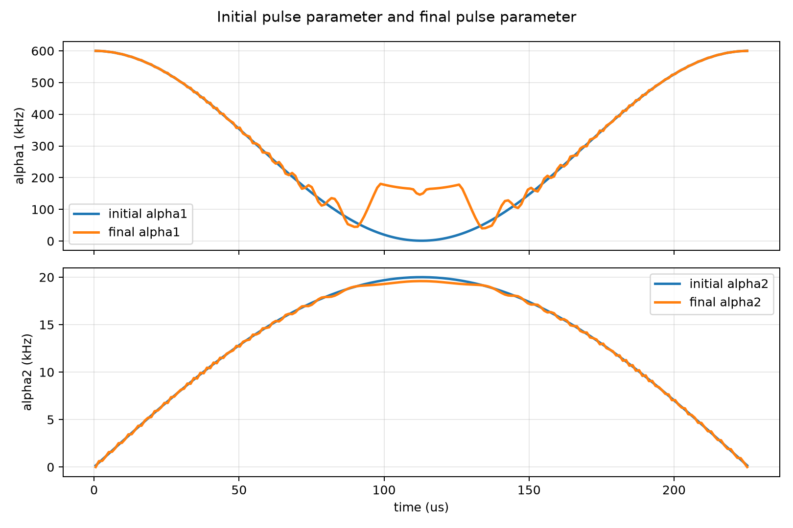
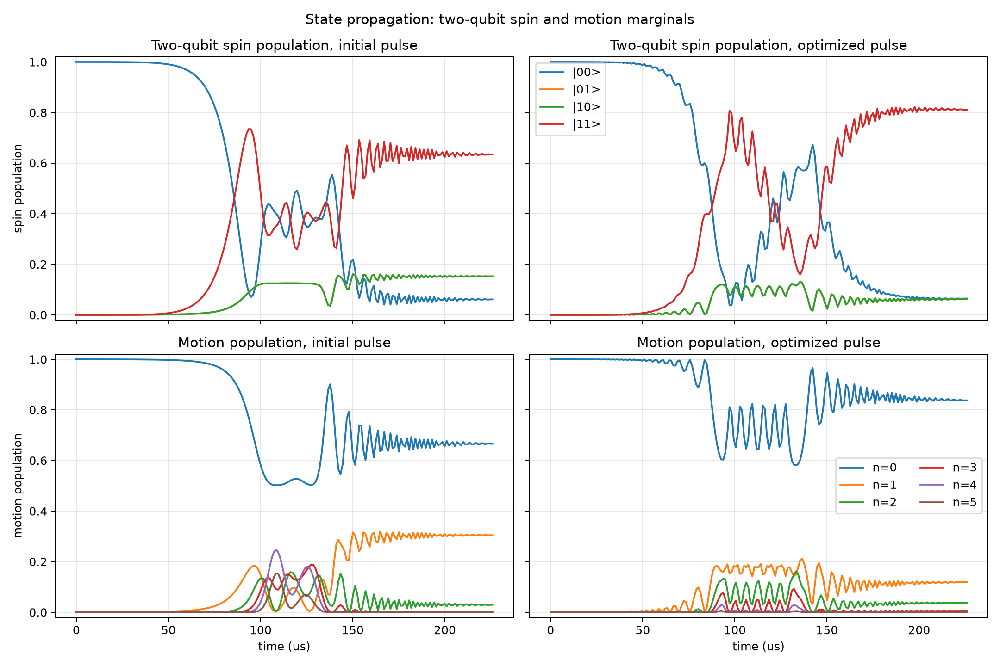

# Spin-Boson L-BFGS-B Optimization

Generated at: 2026-06-22T15:22:18

## Configuration

| Parameter | Value |
| --- | --- |
| objective | state_transfer_fidelity |
| target_state | (\|00,0>-i\|11,0>)/sqrt(2) |
| target_gate | MS_XX(pi/2) |
| n_levels | 6 |
| n_steps | 200 |
| dt_s | 1.129e-06 |
| total_time_us | 225.8 |
| phi_s | 0 |
| alpha1_cycles | 1 |
| alpha1_bounds_khz | 1 to 600 |
| alpha2_bounds_khz | 0 to 20 |
| alpha2_endpoint_constraint | initial and final alpha2 fixed to 0 |
| static_fluctuation_count | 2 |
| control_fluctuation_count | 2 |
| l1_smooth_weight | 0 |
| l2_smooth_weight | 0.0001 |
| print_step | True |
| step_log | step_log.csv |
| initial_pulse_npz | initial_pulse.npz |
| initial_pulse_csv | initial_pulse.csv |
| final_pulse_npz | final_pulse.npz |
| final_pulse_csv | final_pulse.csv |
| optimizer_method | L-BFGS-B |
| optimizer_maximize | True |
| optimizer_options | {'maxiter': 1, 'gtol': 1e-12, 'ftol': 1e-15} |

## Results

| Metric | Initial | Final | Delta |
| --- | --- | --- | --- |
| fidelity | 0.303074641094 | 0.590402697565 | 0.287328056471 |
| close_gate_fidelity | 0.416886183732 | 0.65717226672 | 0.240286082988 |
| open_gate_fidelity | 0.416989188177 | 0.65648638759 | 0.239497199413 |
| l1_penalty | 0 | 0 | 0 |
| l2_penalty | 6.13997480964e-08 | 4.37324813623e-05 | 4.36710816142e-05 |
| penalized_objective | 0.302427949301 | 0.590358965084 | 0.287931015783 |

## Optimizer

| Parameter | Value |
| --- | --- |
| success | False |
| message | STOP: TOTAL NO. OF ITERATIONS REACHED LIMIT |
| nit | 1 |
| nfev | 3 |

## Figures

### Pulse parameters

### State propagation

