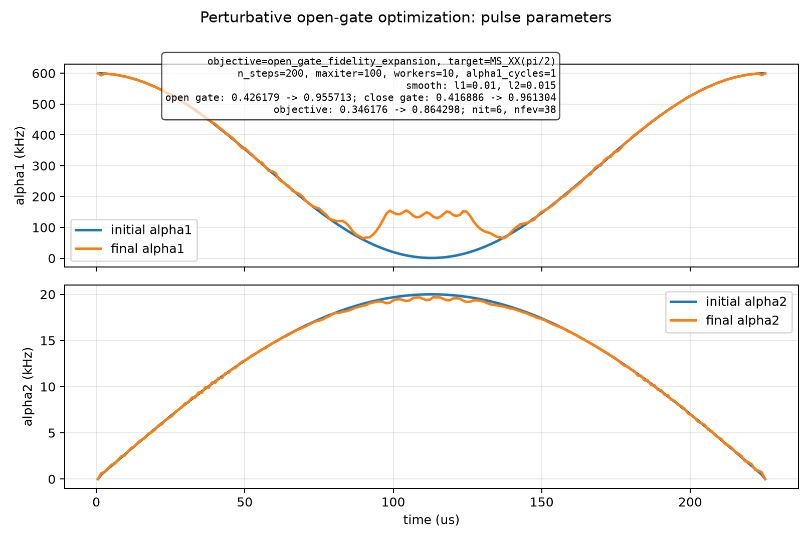
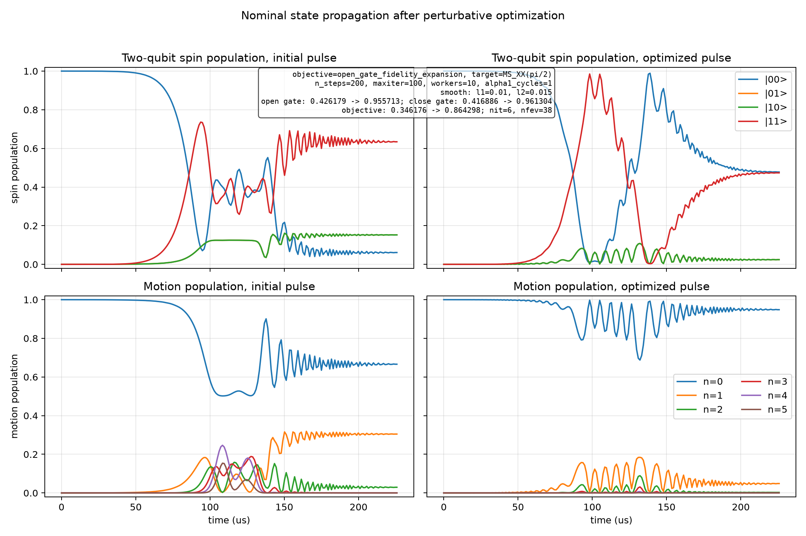

# Spin-Boson Perturbative Open-Gate Optimization

Generated at: 2026-06-22T15:23:09

## Configuration

| Parameter | Value |
| --- | --- |
| objective | open_gate_fidelity_expansion |
| target_state | (\|00,0>-i\|11,0>)/sqrt(2) |
| target_gate | MS_XX(pi/2) |
| n_levels | 6 |
| n_steps | 200 |
| dt_s | 1.129e-06 |
| total_time_us | 225.8 |
| phi_s | 0 |
| alpha1_cycles | 1 |
| alpha1_bounds_khz | 1 to 600 |
| alpha2_bounds_khz | 0 to 20 |
| alpha2_endpoint_constraint | initial and final alpha2 fixed to 0 |
| static_fluctuation_count | 2 |
| control_fluctuation_count | 2 |
| max_order | 2 |
| drop_odd_average | True |
| workers | 10 |
| normalize_weights | False |
| no_progress | False |
| print_step | True |
| state_pair_count | 96 |
| l1_smooth_weight | 0.01 |
| l2_smooth_weight | 0.015 |
| step_log | step_log.csv |
| initial_pulse_npz | initial_pulse.npz |
| initial_pulse_csv | initial_pulse.csv |
| final_pulse_npz | final_pulse.npz |
| final_pulse_csv | final_pulse.csv |
| optimizer_method | L-BFGS-B |
| optimizer_maximize | True |
| optimizer_options | {'maxiter': 100, 'gtol': 1e-12, 'ftol': 1e-15} |

## Results

| Metric | Initial | Final | Delta |
| --- | --- | --- | --- |
| single_state_fidelity | 0.302428010701 | 0.947473274744 | 0.645045264043 |
| close_gate_fidelity | 0.416886183732 | 0.961303636561 | 0.544417452829 |
| open_gate_fidelity | 0.426179051826 | 0.95571336414 | 0.529534312314 |
| l1_penalty | 0.0799938316051 | 0.0888269539824 | 0.00883312237735 |
| l2_penalty | 9.20996221446e-06 | 0.00258862440584 | 0.00257941444362 |
| penalized_objective | 0.346176010259 | 0.864297785751 | 0.518121775493 |

## Optimizer

| Parameter | Value |
| --- | --- |
| success | True |
| message | CONVERGENCE: RELATIVE REDUCTION OF F <= FACTR*EPSMCH |
| nit | 6 |
| nfev | 38 |

## Figures

### Pulse parameters

### State propagation

