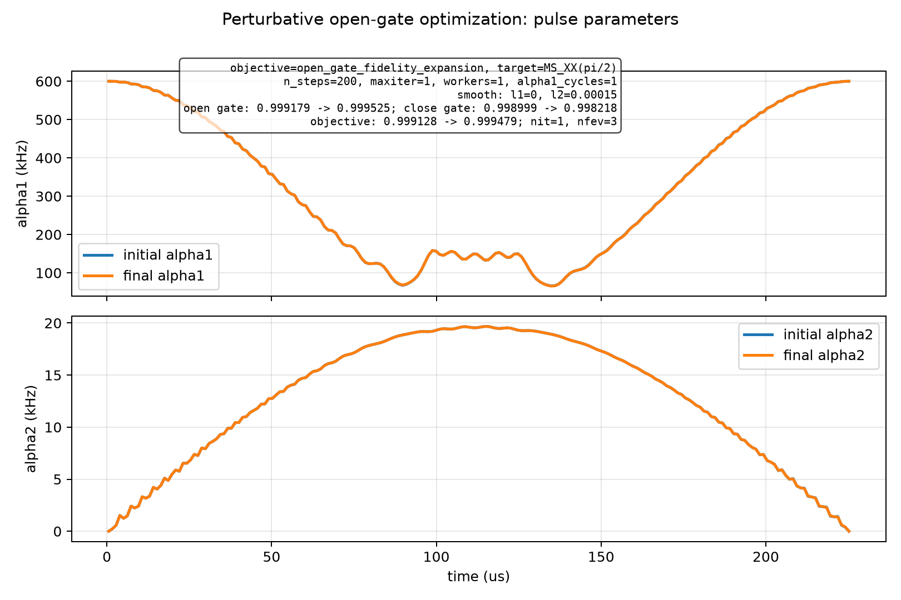
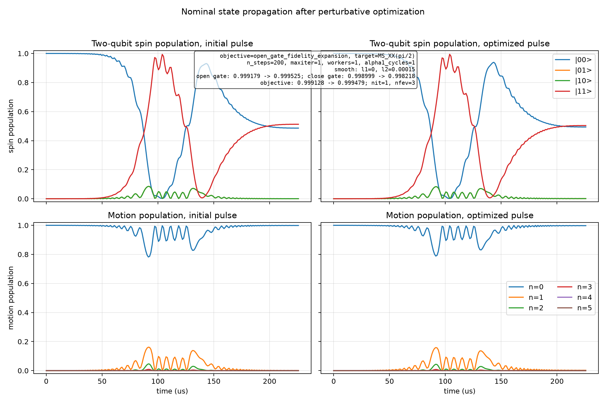

# Spin-Boson Perturbative Open-Gate Optimization

Generated at: 2026-06-22T16:40:52

## Configuration

| Parameter | Value |
| --- | --- |
| objective | open_gate_fidelity_expansion |
| target_state | (\|00,0>-i\|11,0>)/sqrt(2) |
| target_gate | MS_XX(pi/2) |
| n_levels | 6 |
| n_steps | 200 |
| dt_s | 1.129e-06 |
| total_time_us | 225.8 |
| phi_s | 0 |
| alpha1_cycles | 1 |
| alpha1_bounds_khz | 1 to 600 |
| alpha2_bounds_khz | 0 to 20 |
| alpha2_endpoint_constraint | initial and final alpha2 fixed to 0 |
| static_fluctuation_count | 2 |
| control_fluctuation_count | 2 |
| max_order | 2 |
| drop_odd_average | True |
| workers | 1 |
| normalize_weights | False |
| no_progress | True |
| print_step | False |
| state_pair_count | 96 |
| l1_smooth_weight | 0 |
| l2_smooth_weight | 0.00015 |
| initial_pulse_source | custom_npz |
| source_npz | experiments/outputs/spin_boson_perturbative_20260622_155259/final_pulse.npz |
| source_dt | 1.129e-06 |
| experiment_dt | 1.129e-06 |
| dt_missing | False |
| dt_mismatch | False |
| step_log | step_log.csv |
| initial_pulse_npz | initial_pulse.npz |
| initial_pulse_csv | initial_pulse.csv |
| final_pulse_npz | final_pulse.npz |
| final_pulse_csv | final_pulse.csv |
| optimizer_method | L-BFGS-B |
| optimizer_maximize | True |
| optimizer_options | {'maxiter': 1, 'gtol': 1e-12, 'ftol': 1e-15} |

## Results

| Metric | Initial | Final | Delta |
| --- | --- | --- | --- |
| single_state_fidelity | 0.99870750166 | 0.997626486306 | -0.00108101535336 |
| close_gate_fidelity | 0.998999157145 | 0.998218385091 | -0.000780772053783 |
| open_gate_fidelity | 0.9991793122 | 0.999524930159 | 0.000345617959515 |
| l1_penalty | 0 | 0 | 0 |
| l2_penalty | 5.17194161259e-05 | 4.63094672927e-05 | -5.40994883313e-06 |
| penalized_objective | 0.999127592784 | 0.999478620692 | 0.000351027908349 |

## Optimizer

| Parameter | Value |
| --- | --- |
| success | False |
| message | STOP: TOTAL NO. OF ITERATIONS REACHED LIMIT |
| nit | 1 |
| nfev | 3 |

## Figures

### Pulse parameters

### State propagation

