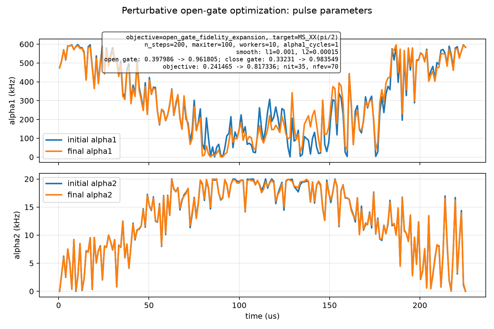
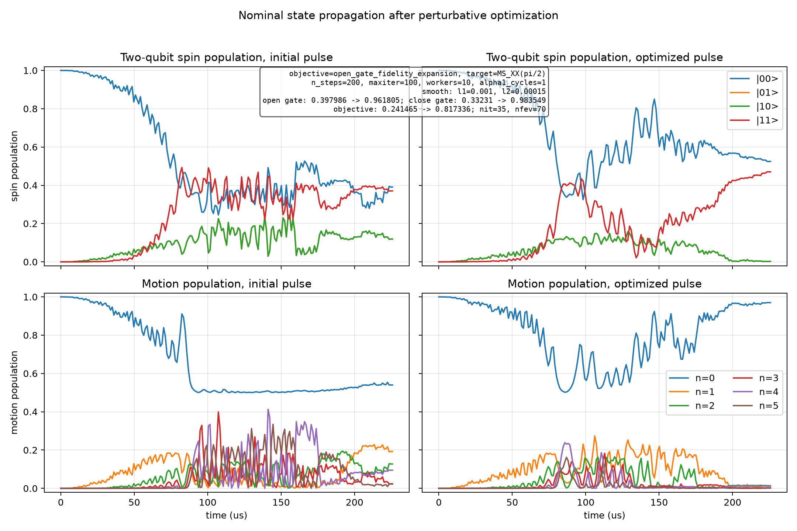

# Spin-Boson Perturbative Open-Gate Optimization

Generated at: 2026-07-01T10:34:37

## Configuration

| Parameter | Value |
| --- | --- |
| objective | open_gate_fidelity_expansion |
| target_state | (\|00,0>-i\|11,0>)/sqrt(2) |
| target_gate | MS_XX(pi/2) |
| n_levels | 6 |
| n_steps | 200 |
| dt_s | 1.129e-06 |
| total_time_us | 225.8 |
| phi_s | 0 |
| alpha1_cycles | 1 |
| alpha1_bounds_khz | 1 to 600 |
| alpha2_bounds_khz | 0 to 20 |
| alpha2_endpoint_constraint | initial and final alpha2 fixed to 0 |
| static_fluctuation_count | 2 |
| control_fluctuation_count | 2 |
| max_order | 2 |
| drop_odd_average | True |
| workers | 10 |
| normalize_weights | False |
| no_progress | False |
| print_step | True |
| print_fidelity_terms | False |
| save_fidelity_terms | False |
| interrupted | False |
| reported_final_step | 35 |
| state_pair_count | 96 |
| l1_smooth_weight | 0.001 |
| l2_smooth_weight | 0.00015 |
| initial_pulse_source | custom_npz |
| source_npz | experiments/outputs/spin_boson_perturbative_sweep_20260622_175724/noise_seed_12345/final_pulse.npz |
| source_dt | 1.129e-06 |
| experiment_dt | 1.129e-06 |
| dt_missing | False |
| dt_mismatch | False |
| step_log | step_log.csv |
| fidelity_terms | disabled |
| fidelity_terms_by_pair | disabled |
| latest_pulse_npz | latest_pulse.npz |
| latest_pulse_csv | latest_pulse.csv |
| latest_parameters | latest_parameters.npz |
| initial_pulse_npz | initial_pulse.npz |
| initial_pulse_csv | initial_pulse.csv |
| final_pulse_npz | final_pulse.npz |
| final_pulse_csv | final_pulse.csv |
| optimizer_method | L-BFGS-B |
| optimizer_maximize | True |
| optimizer_options | {'maxiter': 100, 'gtol': 1e-12, 'ftol': 1e-15} |

## Results

| Metric | Initial | Final | Delta |
| --- | --- | --- | --- |
| single_state_fidelity | 0.129186530942 | 0.968988415705 | 0.839801884763 |
| close_gate_fidelity | 0.332310089606 | 0.983548682892 | 0.651238593286 |
| open_gate_fidelity | 0.397985821712 | 0.96180456212 | 0.563818740408 |
| l1_penalty | 0.12513207684 | 0.115799736028 | -0.00933234081183 |
| l2_penalty | 0.0313884118508 | 0.0286684485758 | -0.00271996327503 |
| penalized_objective | 0.241465333021 | 0.817336377516 | 0.575871044494 |

## Optimizer

| Parameter | Value |
| --- | --- |
| success | True |
| message | CONVERGENCE: RELATIVE REDUCTION OF F <= FACTR*EPSMCH |
| nit | 35 |
| nfev | 70 |

## Figures

### Pulse parameters

### State propagation

