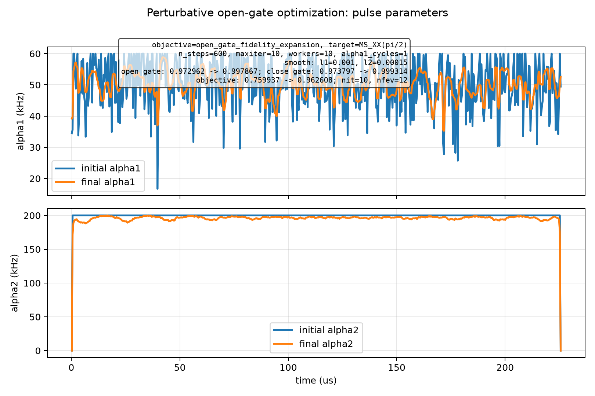
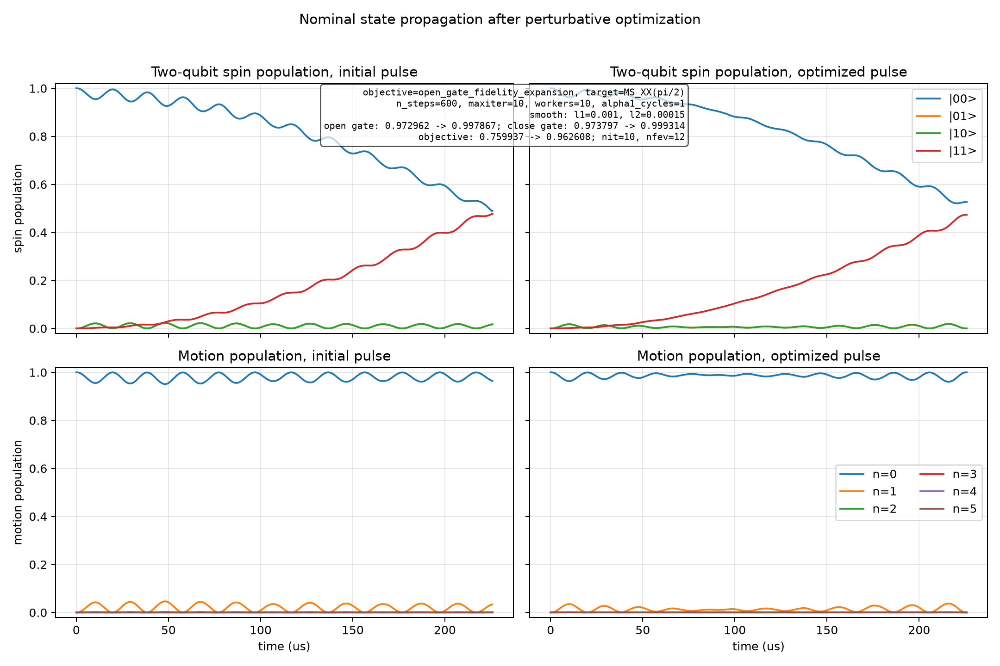

# Spin-Boson Perturbative Open-Gate Optimization

Generated at: 2026-07-02T16:14:53

## Preview

### Configuration

| Parameter | Value |
| --- | --- |
| experiment_dir | spin_boson_perturbative_20260702_161453 |
| objective | open_gate_fidelity_expansion |
| target_state | (\|00,0>-i\|11,0>)/sqrt(2) |
| target_gate | MS_XX(pi/2) |
| n_levels | 6 |
| n_steps | 600 |
| dt_s | 3.76333333333e-07 |
| total_time_us | 225.8 |
| phi_s | 0 |
| eta | 0.075 |
| alpha1_cycles | 1 |
| alpha1_bounds_khz | 1 to 60 |
| alpha2_bounds_khz | 0 to 200 |
| alpha2_endpoint_constraint | initial and final alpha2 fixed to 0 |
| static_fluctuation_count | 2 |
| control_fluctuation_count | 2 |
| max_order | 2 |
| drop_odd_average | True |
| workers | 10 |
| normalize_weights | False |
| no_progress | False |
| print_step | True |
| print_fidelity_terms | False |
| save_fidelity_terms | False |
| state_pair_count | 96 |
| l1_smooth_weight | 0.001 |
| l2_smooth_weight | 0.00015 |

### Optimizer

| Parameter | Value |
| --- | --- |
| optimizer_method | L-BFGS-B |
| optimizer_maximize | True |
| optimizer_options | {'maxiter': 10, 'gtol': 1e-12, 'ftol': 1e-15} |

### Initial Metrics

| Metric | Value |
| --- | --- |
| initial_penalized_objective | 0.759936774919 |
| initial_raw_fidelity | 0.972962223046 |
| initial_close_gate_fidelity | 0.973797255975 |
| initial_open_gate_fidelity | 0.972962223046 |
| initial_l1_penalty | 0.176320871722 |
| initial_l2_penalty | 0.0367045764052 |

### Kappa Diagnostics

| Metric | Value | Definition |
| --- | --- | --- |
| kappa_1 | 0.719983809205 | max_boundary_corner dt * \|\|H_nominal(alpha)\|\|_2 over alpha bounds |
| kappa_2 | 1.61763565195 | max_boundary_corner T * \|\|H_fluctuation(alpha)\|\|_2 over alpha bounds; fluctuation terms are already scaled |
| kappa_1_corner | 3 | boundary corner attaining max \|\|H_nominal\|\|_2 |
| kappa_2_corner | 3 | boundary corner attaining max \|\|H_fluctuation\|\|_2 |
| kappa_1_alpha | (376991.1184307751, 1256637.0614359172) | alpha values at kappa_1 corner in rad/s |
| kappa_2_alpha | (376991.1184307751, 1256637.0614359172) | alpha values at kappa_2 corner in rad/s |
| kappa_1_h_norm | 1913154.49744 | max \|\|H_nominal\|\|_2 |
| kappa_2_h_fluc_norm | 7164.01971633 | max \|\|H_fluctuation\|\|_2 |
| kappa_dt_s | 3.76333333333e-07 | pulse time step |
| kappa_total_time_s | 0.0002258 | pulse total duration |
| kappa_boundary_corner_count | 4 | number of alpha-boundary corners evaluated |

### Output Manifest

| Output | Path |
| --- | --- |
| pulse_plot | spin_boson_perturbative_pulses.png |
| propagation_plot | spin_boson_perturbative_state_propagation.png |
| step_log | step_log.csv |
| fidelity_terms | disabled |
| fidelity_terms_by_pair | disabled |
| latest_pulse_npz | latest_pulse.npz |
| latest_pulse_csv | latest_pulse.csv |
| latest_parameters | latest_parameters.npz |
| initial_pulse_npz | initial_pulse.npz |
| initial_pulse_csv | initial_pulse.csv |
| final_pulse_npz | final_pulse.npz |
| final_pulse_csv | final_pulse.csv |

## Noise Terms

| Term | Coefficient | Definition | Usage | Shape | Frobenius Norm | Spectral Norm | Zero |
| --- | --- | --- | --- | --- | --- | --- | --- |
| static[0] | 314.159 | kron(0.5 * (sz ⊗ I + I ⊗ sz), I_motion) | added directly to H_fluctuation | 24x24 | 1088.27869931 | 314.159 | False |
| static[1] | 1256.637 | kron(I_spin, number_operator) | added directly to H_fluctuation | 24x24 | 18638.9388365 | 6283.185 | False |
| control[0] | 0.0003 | kron(I_spin, number_operator) | alpha1(t) * control[0] | 24x24 | 0.00444971909226 | 0.0015 | False |
| control[1] | 0.0006 | eta * kron(S_phi(mode=(0.5, -0.5)), X1), X1=(a + adag)/2, eta=0.075 | alpha2(t) * control[1] | 24x24 | 0.000174284250579 | 7.47957922549e-05 | False |

## System Construction Script

```python
phi_s = 0.0
eta = 0.075
system = spin_boson_control_system(n_levels=6, phi_s=phi_s, eta=eta)
noisy_system = spin_boson_noisy_control_system(n_levels=6, phi_s=phi_s)
alpha1_khz_bounds = (1.0, 60.0)
alpha2_khz_bounds = (0.0, 200.0)
initial_pulse = _customized_initial_pulse(
    n_steps=600,
    alpha1_khz_bounds=alpha1_khz_bounds,
    alpha2_khz_bounds=alpha2_khz_bounds,
    alpha1_cycles=1.0,
)
parameterization = Alpha2EndpointZeroParameterization(
    spin_boson_parameterization(
        initial_pulse.n_steps,
        alpha1_khz_bounds=alpha1_khz_bounds,
        alpha2_khz_bounds=alpha2_khz_bounds,
    )
)
target_gate = ms_xx_pi_over_2_gate()
state_pairs = motion_resolved_gate_state_pairs(target_gate, 6)
step_builder = PerturbativeStepBuilder()
expansion_objective = ExpansionFidelity(max_order=2, drop_odd_average=True)
optimization_problem = ExpansionStateAverageFidelity(
    system=noisy_system,
    pulse=initial_pulse,
    evolution=PerturbativeExpansionEvolution(step_builder, max_order=2),
    objective=expansion_objective,
    differentiator=PerturbativeExpansionDifferentiator(step_builder, expansion_objective),
    state_pairs=state_pairs,
    normalize_weights=False,
    n_workers=10,
)
parameterized_problem = ParameterizedControlProblem(optimization_problem, parameterization)
penalty = ParameterSmoothPenalty(
    l1_weight=0.001,
    l2_weight=0.00015,
)
penalized_problem = PenalizedParameterizedProblem(parameterized_problem, penalty)
optimizer = ScipyOptimizer(
    method='L-BFGS-B',
    maximize=True,
    options={'maxiter': 10, 'gtol': 1e-12, 'ftol': 1e-15},
)
```

## Results

| Metric | Initial | Final | Delta |
| --- | --- | --- | --- |
| single_state_fidelity | 0.964694870637 | 0.999265487634 | 0.0345706169973 |
| close_gate_fidelity | 0.973797255975 | 0.999314006236 | 0.025516750261 |
| open_gate_fidelity | 0.972962223046 | 0.997866685924 | 0.0249044628781 |
| l1_penalty | 0.176320871722 | 0.0338076031922 | -0.14251326853 |
| l2_penalty | 0.0367045764052 | 0.00145157399912 | -0.0352530024061 |
| penalized_objective | 0.759936774919 | 0.962607508733 | 0.202670733814 |

## Optimizer

| Parameter | Value |
| --- | --- |
| success | False |
| message | STOP: TOTAL NO. OF ITERATIONS REACHED LIMIT |
| nit | 10 |
| nfev | 12 |
| interrupted | False |

## Final Outputs

| Output | Path |
| --- | --- |
| pulse_plot | spin_boson_perturbative_pulses.png |
| propagation_plot | spin_boson_perturbative_state_propagation.png |
| step_log | step_log.csv |
| fidelity_terms | disabled |
| fidelity_terms_by_pair | disabled |
| latest_pulse_npz | latest_pulse.npz |
| latest_pulse_csv | latest_pulse.csv |
| latest_parameters | latest_parameters.npz |
| initial_pulse_npz | initial_pulse.npz |
| initial_pulse_csv | initial_pulse.csv |
| final_pulse_npz | final_pulse.npz |
| final_pulse_csv | final_pulse.csv |

## Figures

### Pulse parameters



### State propagation


