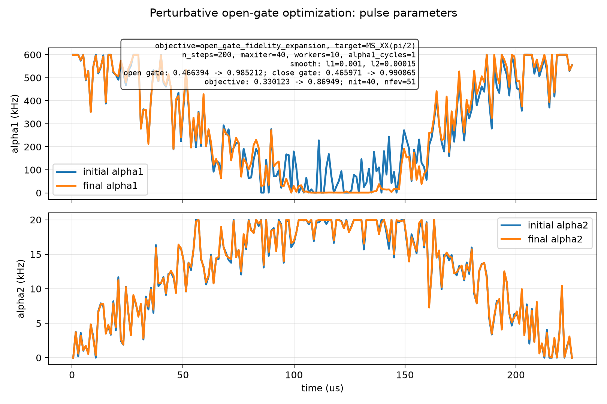
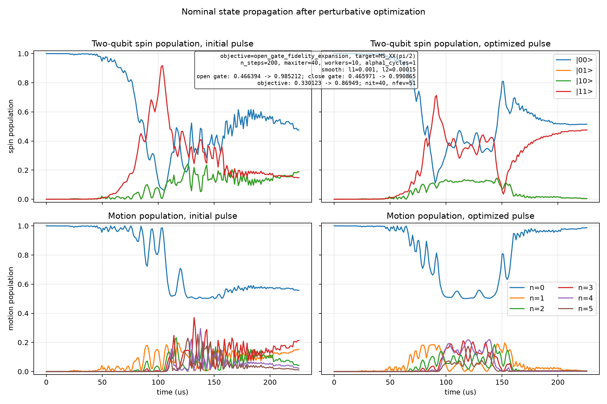

# Spin-Boson Perturbative Open-Gate Optimization

Generated at: 2026-06-22T18:04:36

## Configuration

| Parameter | Value |
| --- | --- |
| objective | open_gate_fidelity_expansion |
| target_state | (\|00,0>-i\|11,0>)/sqrt(2) |
| target_gate | MS_XX(pi/2) |
| n_levels | 6 |
| n_steps | 200 |
| dt_s | 1.129e-06 |
| total_time_us | 225.8 |
| phi_s | 0 |
| alpha1_cycles | 1 |
| alpha1_bounds_khz | 1 to 600 |
| alpha2_bounds_khz | 0 to 20 |
| alpha2_endpoint_constraint | initial and final alpha2 fixed to 0 |
| static_fluctuation_count | 2 |
| control_fluctuation_count | 2 |
| max_order | 2 |
| drop_odd_average | True |
| workers | 10 |
| normalize_weights | False |
| no_progress | True |
| print_step | True |
| interrupted | False |
| reported_final_step | 40 |
| state_pair_count | 96 |
| l1_smooth_weight | 0.001 |
| l2_smooth_weight | 0.00015 |
| sweep_mode | noise |
| sweep_seed | 12349 |
| noise_scale | 0.3 |
| step_log | step_log.csv |
| latest_pulse_npz | latest_pulse.npz |
| latest_pulse_csv | latest_pulse.csv |
| latest_parameters | latest_parameters.npz |
| initial_pulse_npz | initial_pulse.npz |
| initial_pulse_csv | initial_pulse.csv |
| final_pulse_npz | final_pulse.npz |
| final_pulse_csv | final_pulse.csv |
| optimizer_method | L-BFGS-B |
| optimizer_maximize | True |
| optimizer_options | {'maxiter': 40, 'gtol': 1e-12, 'ftol': 1e-15} |

## Results

| Metric | Initial | Final | Delta |
| --- | --- | --- | --- |
| single_state_fidelity | 0.321840292467 | 0.986667397036 | 0.664827104569 |
| close_gate_fidelity | 0.465971019639 | 0.990864979404 | 0.524893959766 |
| open_gate_fidelity | 0.466394373326 | 0.985212471592 | 0.518818098265 |
| l1_penalty | 0.112349194699 | 0.0960942537578 | -0.016254940941 |
| l2_penalty | 0.0239222853772 | 0.01962778854 | -0.00429449683725 |
| penalized_objective | 0.33012289325 | 0.869490429294 | 0.539367536044 |

## Optimizer

| Parameter | Value |
| --- | --- |
| success | False |
| message | STOP: TOTAL NO. OF ITERATIONS REACHED LIMIT |
| nit | 40 |
| nfev | 51 |

## Figures

### Pulse parameters

### State propagation

