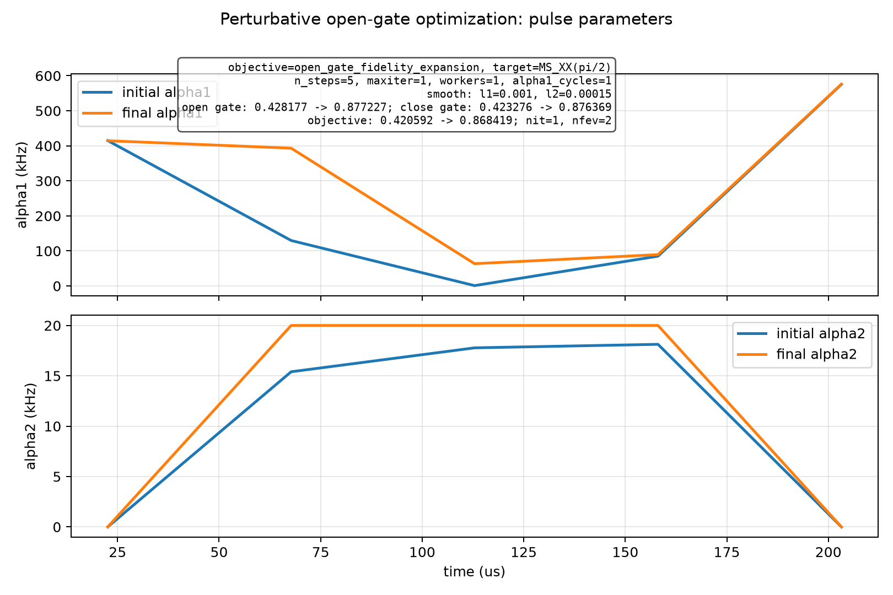
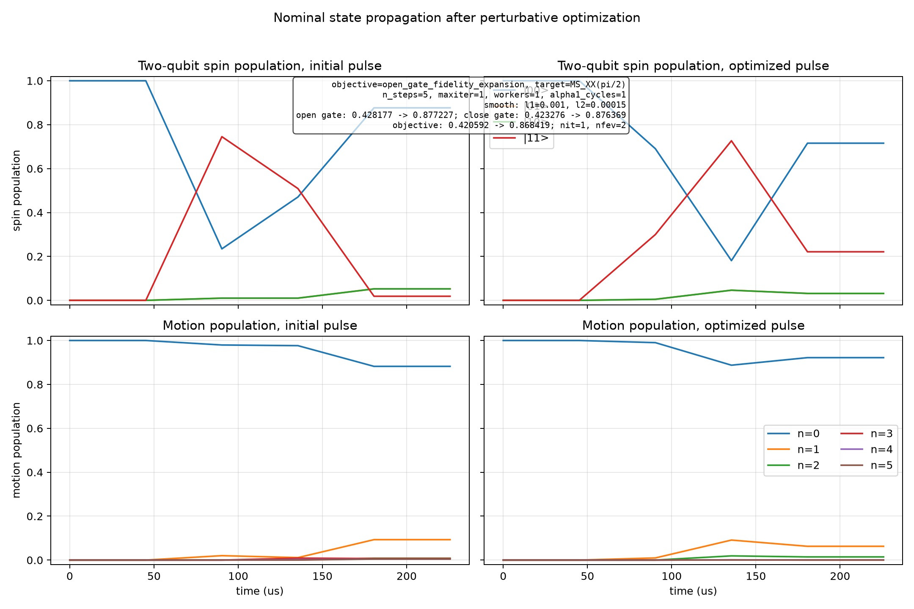

# Spin-Boson Perturbative Open-Gate Optimization

Generated at: 2026-07-01T10:10:23

## Configuration

| Parameter | Value |
| --- | --- |
| objective | open_gate_fidelity_expansion |
| target_state | (\|00,0>-i\|11,0>)/sqrt(2) |
| target_gate | MS_XX(pi/2) |
| n_levels | 6 |
| n_steps | 5 |
| dt_s | 4.516e-05 |
| total_time_us | 225.8 |
| phi_s | 0 |
| alpha1_cycles | 1 |
| alpha1_bounds_khz | 1 to 600 |
| alpha2_bounds_khz | 0 to 20 |
| alpha2_endpoint_constraint | initial and final alpha2 fixed to 0 |
| static_fluctuation_count | 2 |
| control_fluctuation_count | 2 |
| max_order | 2 |
| drop_odd_average | True |
| workers | 1 |
| normalize_weights | False |
| no_progress | True |
| print_step | False |
| print_fidelity_terms | True |
| save_fidelity_terms | True |
| interrupted | False |
| reported_final_step | 1 |
| state_pair_count | 96 |
| l1_smooth_weight | 0.001 |
| l2_smooth_weight | 0.00015 |
| sweep_mode | noise |
| sweep_seed | 12345 |
| noise_scale | 0.3 |
| step_log | step_log.csv |
| fidelity_terms | fidelity_terms.csv |
| fidelity_terms_by_pair | fidelity_terms_by_pair.csv |
| latest_pulse_npz | latest_pulse.npz |
| latest_pulse_csv | latest_pulse.csv |
| latest_parameters | latest_parameters.npz |
| initial_pulse_npz | initial_pulse.npz |
| initial_pulse_csv | initial_pulse.csv |
| final_pulse_npz | final_pulse.npz |
| final_pulse_csv | final_pulse.csv |
| optimizer_method | L-BFGS-B |
| optimizer_maximize | True |
| optimizer_options | {'maxiter': 1, 'gtol': 1e-12, 'ftol': 1e-15} |

## Results

| Metric | Initial | Final | Delta |
| --- | --- | --- | --- |
| single_state_fidelity | 0.35730489793 | 0.84799449666 | 0.49068959873 |
| close_gate_fidelity | 0.423275617387 | 0.876369055882 | 0.453093438495 |
| open_gate_fidelity | 0.42817651602 | 0.877226987003 | 0.449050470983 |
| l1_penalty | 0.00654548903311 | 0.00688270433664 | 0.000337215303531 |
| l2_penalty | 0.00103867299956 | 0.00192515083524 | 0.000886477835678 |
| penalized_objective | 0.420592353987 | 0.868419131831 | 0.447826777844 |

## Optimizer

| Parameter | Value |
| --- | --- |
| success | False |
| message | STOP: TOTAL NO. OF ITERATIONS REACHED LIMIT |
| nit | 1 |
| nfev | 2 |

## Figures

### Pulse parameters

### State propagation

