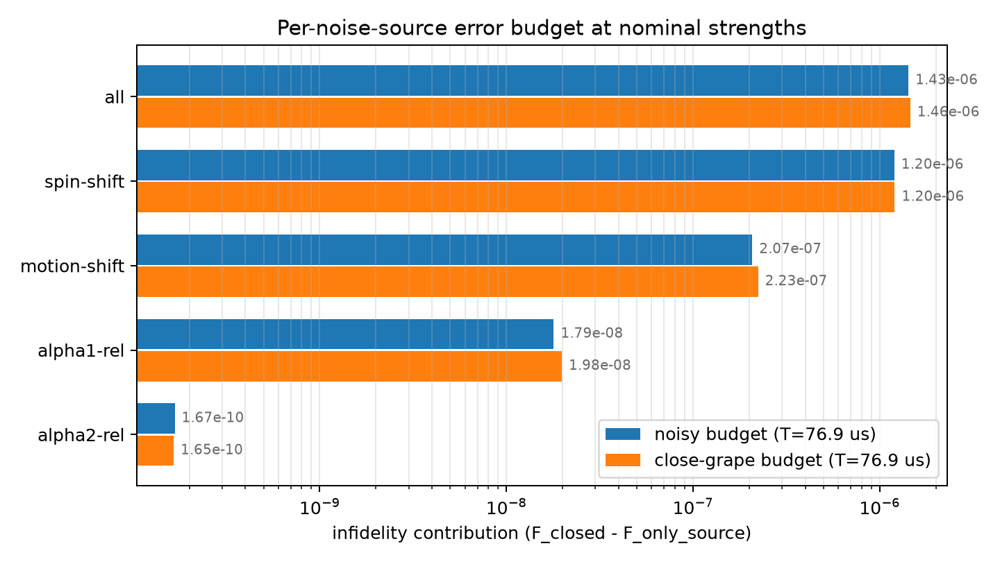

# Error Budget: Per-Noise-Source Infidelity at Nominal Strengths

Generated at: 2026-08-11T14:16:18

Each row evaluates the pulse with only that noise term active (`noisy_gate_fidelity`; strengths as configured). The contribution is `F_closed - F_only_source`; at leading order the contributions add up to the all-terms row, and the residual below measures how well they do.

## Run Summary

| Parameter | Value |
| --- | --- |
| config | experiments/robustness_eval/best_time_shrink_flattop/config.yaml |
| pulse_npz | experiments/robustness_eval/best_time_shrink_flattop/final_pulse_s400.npz |
| close_grape_pulse_npz | experiments/robustness_eval/best_time_shrink_flattop/final_pulse_s400_close_69.npz |
| system_type | spin_boson |
| n_steps | 400 |
| total_time_us | 76.89881521585632 |
| close_grape_total_time_us | 76.8988 |
| faithful | False |
| hermite_points | NA |
| closed_gate_fidelity | 0.999999409318 |
| close_grape_closed_gate_fidelity | 0.999999510882 |
| wall_s | 111.2 |

## Budget

| source | kind | strength | scaled_spectral_norm | noisy_gate_fidelity | infidelity_contribution | close_grape_noisy_gate_fidelity | close_grape_infidelity_contribution |
| --- | --- | --- | --- | --- | --- | --- | --- |
| spin-shift | fluctuation-static | 31.4159 | 31.4159 | 0.999998212426 | 1.19689173639e-06 | 0.999998306973 | 1.20390949909e-06 |
| motion-shift | fluctuation-static | 30 | 150 | 0.999999201838 | 2.07479926906e-07 | 0.999999287996 | 2.2288566448e-07 |
| alpha1-rel | fluctuation-control | 0.0001 | 0.0005 | 0.999999391379 | 1.79392732891e-08 | 0.99999949107 | 1.98118250694e-08 |
| alpha2-rel | fluctuation-control | 0.0001 | 1.24659653758e-05 | 0.999999409151 | 1.67000080431e-10 | 0.999999510717 | 1.64954272464e-10 |
| all | total | not computed | not computed | 0.999997984297 | 1.42502112488e-06 | 0.999998054756 | 1.45612635383e-06 |

## Additivity

| pulse | (F_closed - F_all) - sum of contributions |
| --- | --- |
| pulse_npz | 2.54319e-09 |
| close_grape_pulse_npz | 9.35441e-09 |

## Validity Budget

Perturbative-method validity metrics: [error_budget.md](validity/error_budget.md)

## Figure

