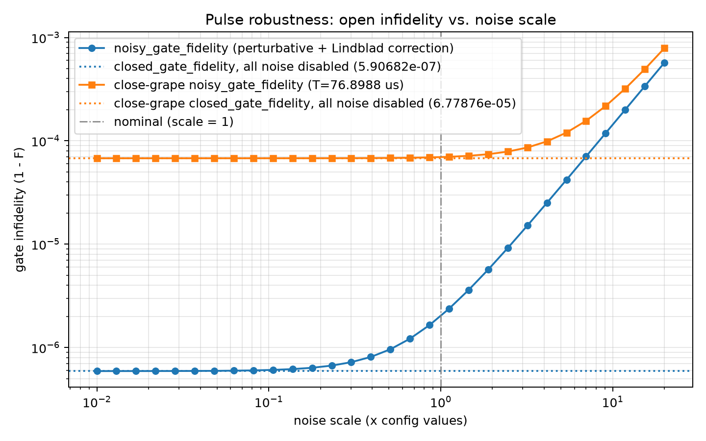

# Robustness Evaluation: Open Fidelity vs. Noise Scale

Generated at: 2026-07-15T13:49:20

All fluctuation sigmas and decoherence rates from the config are multiplied by each scale factor (noise types disabled in the config stay disabled); the pulse is then evaluated with `noisy_gate_fidelity`. `closed_gate_fidelity` (all noise disabled) is the scale -> 0 reference. The perturbative expansion is second-order in the noise strength, so values at large scales are qualitative at best.

## Run Summary

| Parameter | Value |
| --- | --- |
| config | experiments/robustness_eval/best_time_shrink_flattop/config.yaml |
| pulse_npz | /Users/kun/Documents/GRAPE VERGE/experiments/robustness_eval/best_time_shrink_flattop/final_pulse_s400.npz |
| close_grape_pulse_npz | experiments/spin_boson/close_grape/spin_boson_close_20260714_220349/pulse/final_pulse_s400.npz |
| system_type | spin_boson |
| n_steps | 400 |
| total_time_us | 76.89881521585632 |
| close_grape_total_time_us | 76.8988 |
| n_fluctuation_terms (scale=1) | 4 |
| n_decoherence_channels (scale=1) | 0 |
| scales | 0.01, 0.0129966, 0.0168911, 0.0219526, 0.0285308, 0.0370803, 0.0481916, 0.0626326, 0.0814009, 0.105793, 0.137495, 0.178696, 0.232243, 0.301837, 0.392284, 0.509835, 0.66261, 0.861165, 1.11922, 1.4546, 1.89048, 2.45698, 3.19323, 4.1501, 5.3937, 7.00996, 9.11054, 11.8406, 15.3887, 20 |
| faithful | False |
| hermite_points | NA |
| y_scale | infidelity |
| workers | 10 |
| closed_gate_fidelity | 0.999999409318 |
| close_grape_closed_gate_fidelity | 0.999932212396 |
| wall_s | 42.2 |

## Fidelity vs. Noise Scale

| scale | noisy_gate_fidelity | faithful_gate_fidelity | close_grape_noisy_gate_fidelity | close_grape_faithful_gate_fidelity |
| --- | --- | --- | --- | --- |
| 0.01 | 0.999999409176 | not computed | 0.999932212216 | not computed |
| 0.0129966 | 0.999999409077 | not computed | 0.999932212092 | not computed |
| 0.0168911 | 0.999999408912 | not computed | 0.999932211882 | not computed |
| 0.0219526 | 0.999999408631 | not computed | 0.999932211528 | not computed |
| 0.0285308 | 0.999999408158 | not computed | 0.99993221093 | not computed |
| 0.0370803 | 0.999999407359 | not computed | 0.999932209919 | not computed |
| 0.0481916 | 0.999999406009 | not computed | 0.999932208213 | not computed |
| 0.0626326 | 0.999999403728 | not computed | 0.99993220533 | not computed |
| 0.0814009 | 0.999999399876 | not computed | 0.999932200461 | not computed |
| 0.105793 | 0.999999393369 | not computed | 0.999932192237 | not computed |
| 0.137495 | 0.999999382378 | not computed | 0.999932178345 | not computed |
| 0.178696 | 0.999999363814 | not computed | 0.99993215488 | not computed |
| 0.232243 | 0.999999332457 | not computed | 0.999932115245 | not computed |
| 0.301837 | 0.999999279491 | not computed | 0.999932048298 | not computed |
| 0.392284 | 0.999999190026 | not computed | 0.999931935217 | not computed |
| 0.509835 | 0.99999903891 | not computed | 0.999931744211 | not computed |
| 0.66261 | 0.99999878366 | not computed | 0.999931421582 | not computed |
| 0.861165 | 0.999998352514 | not computed | 0.999930876626 | not computed |
| 1.11922 | 0.999997624263 | not computed | 0.999929956137 | not computed |
| 1.4546 | 0.999996394168 | not computed | 0.999928401332 | not computed |
| 1.89048 | 0.999994316407 | not computed | 0.999925775101 | not computed |
| 2.45698 | 0.999990806844 | not computed | 0.999921339114 | not computed |
| 3.19323 | 0.999984878816 | not computed | 0.999913846256 | not computed |
| 4.1501 | 0.999974865742 | not computed | 0.999901190014 | not computed |
| 5.3937 | 0.999957952584 | not computed | 0.999879812264 | not computed |
| 7.00996 | 0.999929384445 | not computed | 0.999843702951 | not computed |
| 9.11054 | 0.999881129793 | not computed | 0.999782710445 | not computed |
| 11.8406 | 0.999799622508 | not computed | 0.999679687558 | not computed |
| 15.3887 | 0.999661947957 | not computed | 0.999505670847 | not computed |
| 20 | 0.999429400867 | not computed | 0.999211737949 | not computed |

## Figure

