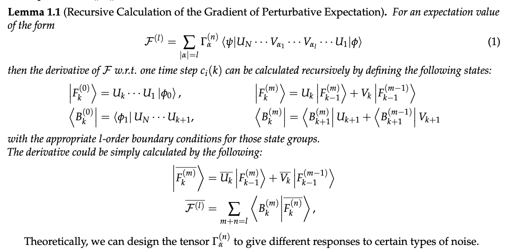
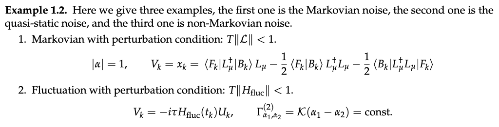
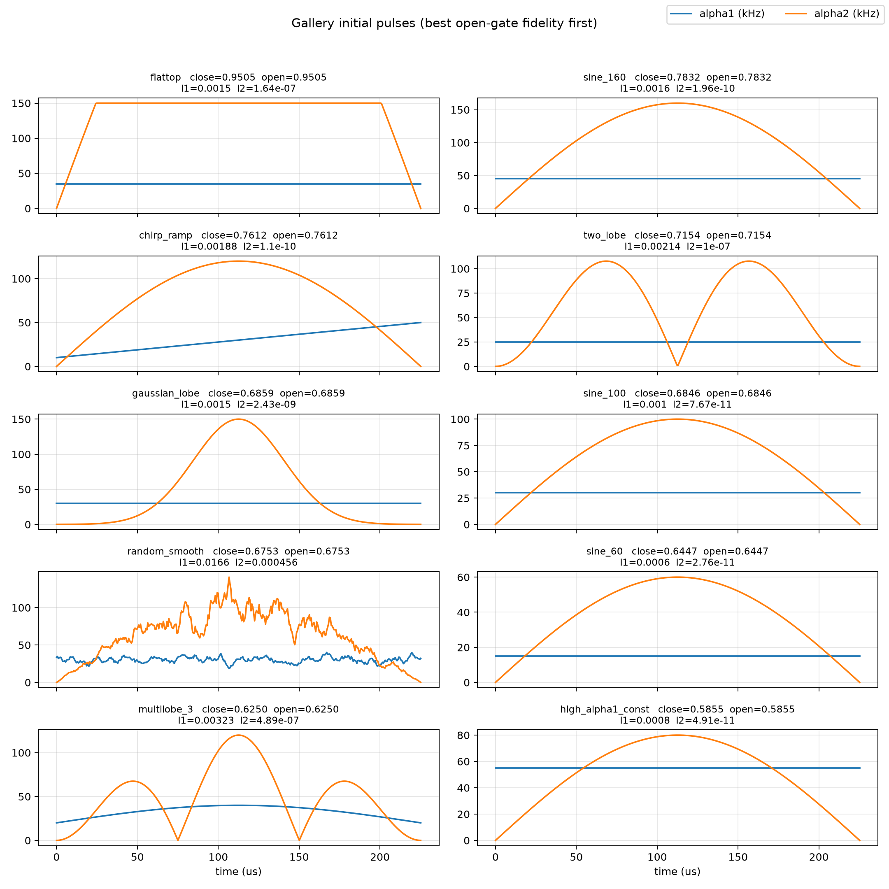
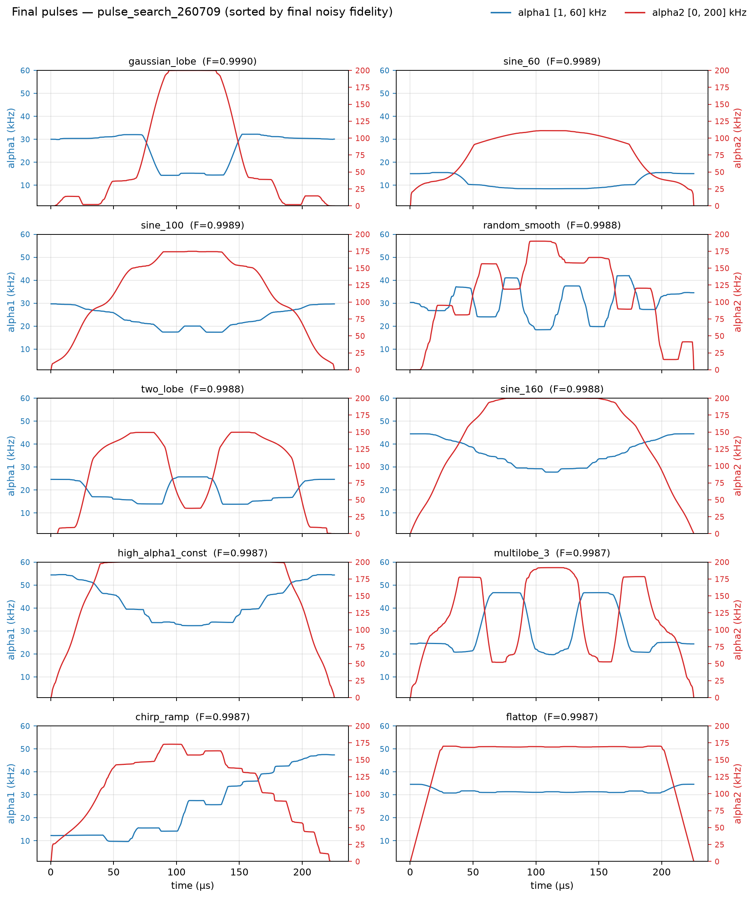
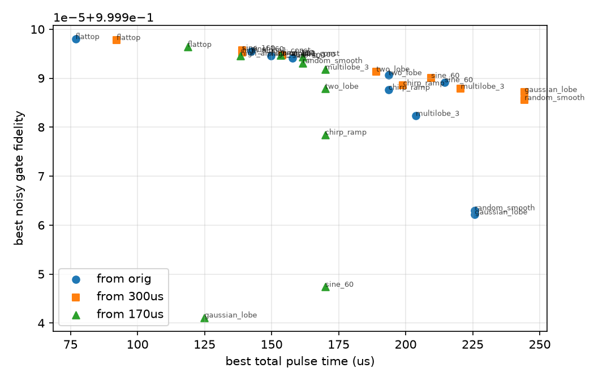
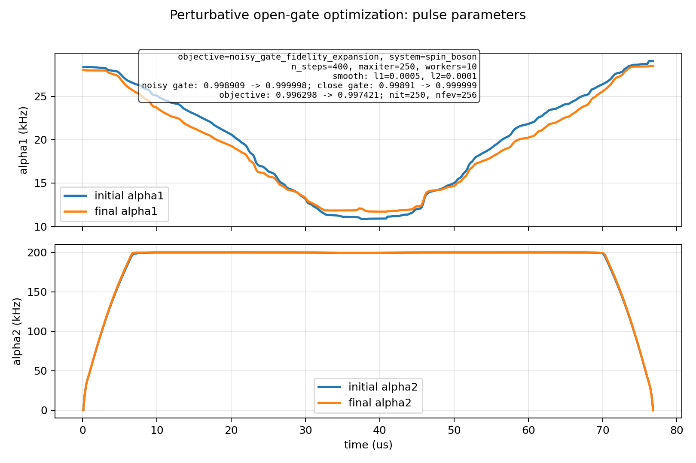
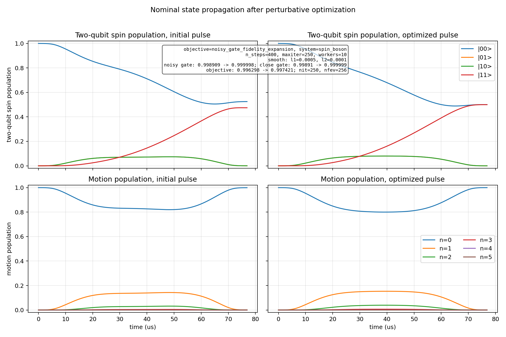
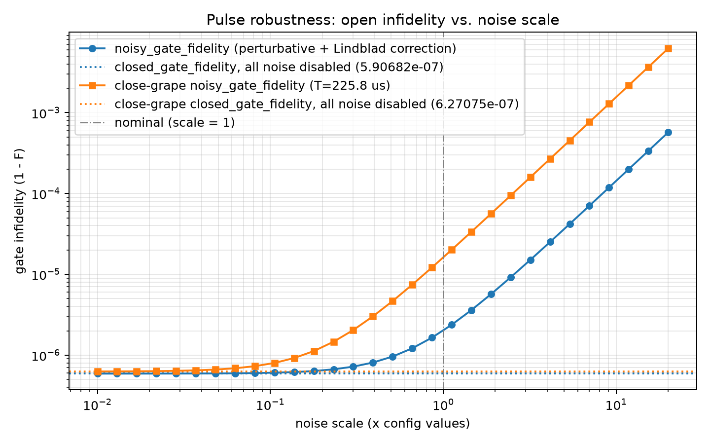
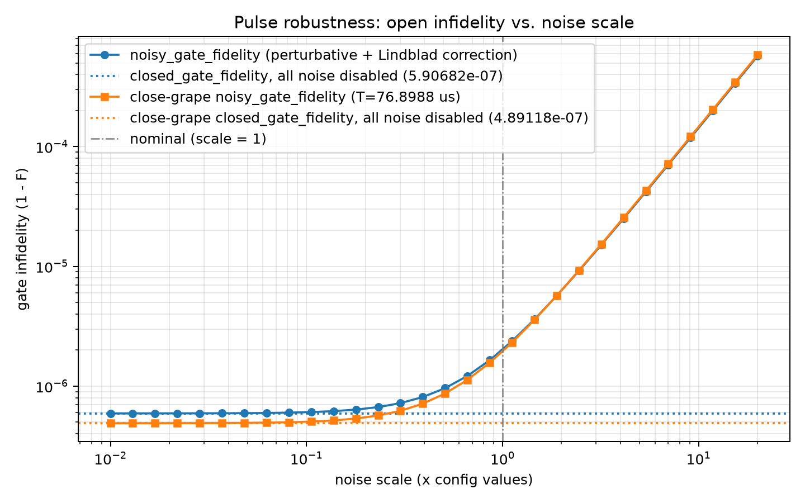
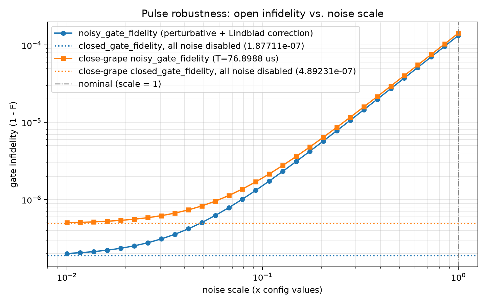

# Grape Ion-trap Report
Project duration: 260510 - present
Report date: 260715
Report duration: 30mins

---

## Content
- Fit noisy Ion-trap system into grapable effective system. (show the results only)
- GRAPE (breifly intro the gate fidelity and the grape algorithm I used)
- Experiments
    1. time_shrinking
    2. pulse_search
    3. robustness_eval
- Forward works

---
## The system
$$H_{\text{stretch}} = \frac{\Omega}{2} \eta \cdot \frac{1}{2}(\sigma_{\phi_s}^{(1)} - \sigma_{\phi_s}^{(2)}) \otimes (a_k e^{i(\delta t - \phi_m)} + a_k^\dagger e^{-i(\delta t - \phi_m)})$$

$$H_{\text{stretch}} \to \tilde H_{\text{stretch}} = - (\delta + \delta't + \phi'_m)a_k^\dagger a_k + \frac{\Omega}{2} \eta (\sigma_{\phi_s}^{(1)} - \sigma_{\phi_s}^{(2)}) \otimes (a_k + a_k^\dagger)$$

Define $a_k^\dagger a_k = \hat n$, $a_k + a_k^\dagger =\hat x$, $(\sigma_{\phi_s}^{(1)} - \sigma_{\phi_s}^{(2)}) = S^-_{\phi_s}$. 
The hamiltonian with fluctuation is
$$H = \alpha_1(t) (1 + \chi_1)\hat n + \alpha_2(t) (1+\chi_2)S^-_{\phi_s} \otimes \hat x_k + \xi_1 S_{\phi_s}^{+} + \xi_2 \hat n$$

---

$$H = \alpha_1(t) (1 + \chi_1)\hat n + \alpha_2(t)\eta (1+\chi_2)S^-_{\phi_s} \otimes \hat x_k + \xi_1 S_{\phi_s}^{+} + \xi_2 \hat n$$
All experiments use one of these two configuration.
$$
\begin{array}{cc}
\begin{aligned}
    &\alpha_1\in 2\pi \cdot[1, 60] kHz \\
    &\alpha_2\in 2\pi \cdot[0, 200] kHz \\
    &\alpha_2(0)=\alpha_2(T)=0 \\
    &\sigma(\chi_1)=0.0001,\quad \sigma(\chi_2)=0.0001 \\
    &\sigma(\xi_1)=2\pi\cdot50Hz,\quad \sigma(\xi_2)=2\pi\cdot200Hz \\
    &T=225.8\,\mu s
\end{aligned}

&
\begin{aligned}
    &\alpha_1\in 2\pi \cdot[1, 60] kHz \\
    &\alpha_2\in 2\pi \cdot[0, 200] kHz \\
    &\alpha_2(0)=\alpha_2(T)=0 \\
    &\sigma(\chi_1)=0.0001,\quad \sigma(\chi_2)=0.0001 \\
    &\sigma(\xi_1)=2\pi\cdot5Hz,\quad \sigma(\xi_2)=2\pi\cdot20Hz \\
    &T=225.8\,\mu s
\end{aligned}
\end{array}
$$
$$\begin{array}{cc}
10^{-3} & &&&&&&&&&&&&&&& 10^{-4}
\end{array}
$$

---
## GRAPE
Gate Fidelity
$$
\newcommand{\vb}[1]{\boldsymbol{#1}}
\newcommand{\expval}[1]{\left\langle #1 \right\rangle}
\newcommand{\ketbra}[1]{\left| #1 \right\rangle\!\left\langle #1 \right|}
\begin{align*}
    F &= \frac{1}{N} \sum_{p,q}\bra{p,q}\hat U^\dagger U(0, T; \vb c)\ketbra{p_0,q} U(0, T; \vb c)^\dagger \hat U \ket{p,q}\\
    \mathcal{F} &= \frac{1}{N} \sum_{p,q}\expval{\bra{p,q}\hat U^\dagger {\mathcal{E}_\xi}\left(\ketbra{p_0,q};\vb c \right)\hat U \ket{p,q}}\\
    \mathcal{J} &= 1 - \mathcal{F} + \lambda L_1
\end{align*}
$$
where the set of $q$ spans the logical subspace. For a two-qubit gate, the logical subspace is spanned by $\{\ket{0}, \ket{1}, \ket{+}, \ket{-}\}^{\otimes 2}$. Thus $N = 16$.

---

---

---
## Experiments

1. pulse_search: start with 10 different pulse guess, find their optimal. 
2. time_shrinking: start from those 10 optimized pulse, stretch/shrink the pulse without optimization first, and repeat optimize-shrink process with shrink scale 0.9.
3. evaluation_check: comparing open gate fidelity with Gauss-Hermit method. 

---
## Pulse Search

  
  

---
## Time shrink

---
## The best pulse

  
  

---
#### Robustness of the best pulse 
noise = scale * right config 2 noise.

  
  

---

do the open grape after close grape, config 1, 76us total time.

Does this meaning that my open grape result is not better than close grape?

---
## Forward work
1. detailed parameter scanning. 
2. optimize a different system.
3. Non-markovian term?

