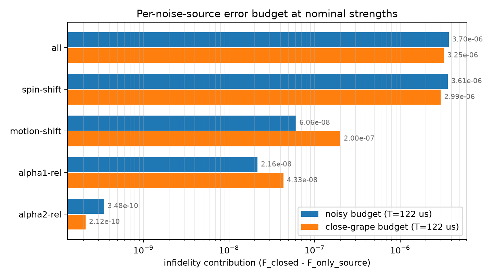

# Error Budget: Per-Noise-Source Infidelity at Nominal Strengths

Generated at: 2026-08-11T17:38:58

Each row evaluates the pulse with only that noise term active (`noisy_gate_fidelity`; strengths as configured). The contribution is `F_closed - F_only_source`; at leading order the contributions add up to the all-terms row, and the residual below measures how well they do.

## Run Summary

| Parameter | Value |
| --- | --- |
| config | experiments/spin_boson/robustness_eval/flattop_122us/config.yaml |
| pulse_npz | experiments/spin_boson/robustness_eval/flattop_122us/final_pulse_s400_T122.npz |
| close_grape_pulse_npz | experiments/spin_boson/robustness_eval/flattop_122us/final_pulse_s400_T122_close.npz |
| system_type | spin_boson |
| n_steps | 400 |
| total_time_us | 122.01330779422334 |
| close_grape_total_time_us | 122.013 |
| faithful | False |
| hermite_points | NA |
| closed_gate_fidelity | 0.999999732764 |
| close_grape_closed_gate_fidelity | 0.999999851426 |
| wall_s | 113.3 |

## Budget

| source | kind | strength | scaled_spectral_norm | noisy_gate_fidelity | infidelity_contribution | close_grape_noisy_gate_fidelity | close_grape_infidelity_contribution |
| --- | --- | --- | --- | --- | --- | --- | --- |
| spin-shift | fluctuation-static | 31.4159 | 31.4159 | 0.999996122246 | 3.61051775655e-06 | 0.999996864687 | 2.9867389959e-06 |
| motion-shift | fluctuation-static | 30 | 150 | 0.999999672155 | 6.06088836896e-08 | 0.999999651021 | 2.00404588924e-07 |
| alpha1-rel | fluctuation-control | 0.0001 | 0.0005 | 0.999999711194 | 2.15701714268e-08 | 0.999999808079 | 4.3346778611e-08 |
| alpha2-rel | fluctuation-control | 0.0001 | 1.24659653758e-05 | 0.999999732416 | 3.48079343127e-10 | 0.999999851214 | 2.11912154491e-10 |
| all | total | not computed | not computed | 0.999996030731 | 3.70203336875e-06 | 0.999996596883 | 3.25454252559e-06 |

## Additivity

| pulse | (F_closed - F_all) - sum of contributions |
| --- | --- |
| pulse_npz | 8.98848e-09 |
| close_grape_pulse_npz | 2.38402e-08 |

## Validity Budget

Perturbative-method validity metrics: [error_budget.md](validity/error_budget.md)

## Figure

