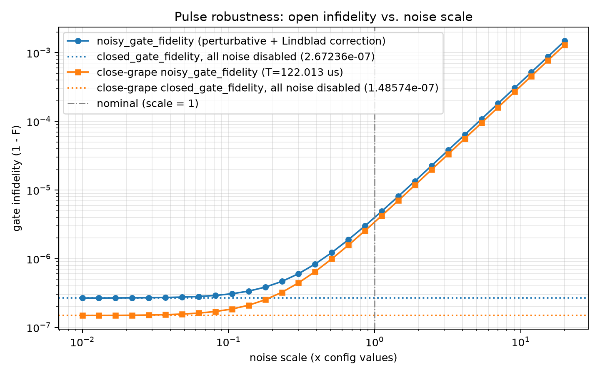

# Robustness Evaluation: Open Fidelity vs. Noise Scale

Generated at: 2026-08-11T17:41:14

All fluctuation sigmas and decoherence rates from the config are multiplied by each scale factor (noise types disabled in the config stay disabled); the pulse is then evaluated with `noisy_gate_fidelity`. `closed_gate_fidelity` (all noise disabled) is the scale -> 0 reference. The perturbative expansion is second-order in the noise strength, so values at large scales are qualitative at best.

## Run Summary

| Parameter | Value |
| --- | --- |
| config | experiments/spin_boson/robustness_eval/flattop_122us/config.yaml |
| pulse_npz | experiments/spin_boson/robustness_eval/flattop_122us/final_pulse_s400_T122.npz |
| close_grape_pulse_npz | experiments/spin_boson/robustness_eval/flattop_122us/final_pulse_s400_T122_close.npz |
| system_type | spin_boson |
| n_steps | 400 |
| total_time_us | 122.01330779422334 |
| close_grape_total_time_us | 122.013 |
| n_fluctuation_terms (scale=1) | 4 |
| n_decoherence_channels (scale=1) | 0 |
| scales | 0.01, 0.0129966, 0.0168911, 0.0219526, 0.0285308, 0.0370803, 0.0481916, 0.0626326, 0.0814009, 0.105793, 0.137495, 0.178696, 0.232243, 0.301837, 0.392284, 0.509835, 0.66261, 0.861165, 1.11922, 1.4546, 1.89048, 2.45698, 3.19323, 4.1501, 5.3937, 7.00996, 9.11054, 11.8406, 15.3887, 20 |
| faithful | False |
| hermite_points | NA |
| y_scale | infidelity |
| workers | 10 |
| closed_gate_fidelity | 0.999999732764 |
| close_grape_closed_gate_fidelity | 0.999999851426 |
| wall_s | 41.1 |

## Fidelity vs. Noise Scale

| scale | noisy_gate_fidelity | faithful_gate_fidelity | close_grape_noisy_gate_fidelity | close_grape_faithful_gate_fidelity |
| --- | --- | --- | --- | --- |
| 0.01 | 0.999999732394 | not computed | 0.9999998511 | not computed |
| 0.0129966 | 0.999999732139 | not computed | 0.999999850876 | not computed |
| 0.0168911 | 0.999999731708 | not computed | 0.999999850497 | not computed |
| 0.0219526 | 0.99999973098 | not computed | 0.999999849857 | not computed |
| 0.0285308 | 0.99999972975 | not computed | 0.999999848777 | not computed |
| 0.0370803 | 0.999999727674 | not computed | 0.999999846951 | not computed |
| 0.0481916 | 0.999999724166 | not computed | 0.999999843867 | not computed |
| 0.0626326 | 0.999999718241 | not computed | 0.999999838659 | not computed |
| 0.0814009 | 0.999999708234 | not computed | 0.999999829861 | not computed |
| 0.105793 | 0.99999969133 | not computed | 0.999999815 | not computed |
| 0.137495 | 0.999999662778 | not computed | 0.999999789899 | not computed |
| 0.178696 | 0.99999961455 | not computed | 0.999999747501 | not computed |
| 0.232243 | 0.999999533087 | not computed | 0.999999675885 | not computed |
| 0.301837 | 0.999999395489 | not computed | 0.999999554919 | not computed |
| 0.392284 | 0.99999916307 | not computed | 0.999999350595 | not computed |
| 0.509835 | 0.999998770489 | not computed | 0.999999005468 | not computed |
| 0.66261 | 0.999998107379 | not computed | 0.999998422513 | not computed |
| 0.861165 | 0.999996987315 | not computed | 0.999997437838 | not computed |
| 1.11922 | 0.999995095405 | not computed | 0.999995774617 | not computed |
| 1.4546 | 0.999991899768 | not computed | 0.999992965259 | not computed |
| 1.89048 | 0.999986501993 | not computed | 0.999988219951 | not computed |
| 2.45698 | 0.999977384572 | not computed | 0.999980204617 | not computed |
| 3.19323 | 0.99996198427 | not computed | 0.999966665858 | not computed |
| 4.1501 | 0.999935971506 | not computed | 0.99994379744 | not computed |
| 5.3937 | 0.999892033158 | not computed | 0.999905170229 | not computed |
| 7.00996 | 0.999817816572 | not computed | 0.999839924725 | not computed |
| 9.11054 | 0.999692456795 | not computed | 0.999729718067 | not computed |
| 11.8406 | 0.999480710679 | not computed | 0.999543567194 | not computed |
| 15.3887 | 0.999123048767 | not computed | 0.999229138396 | not computed |
| 20 | 0.998518919417 | not computed | 0.998698034414 | not computed |

## Figure

