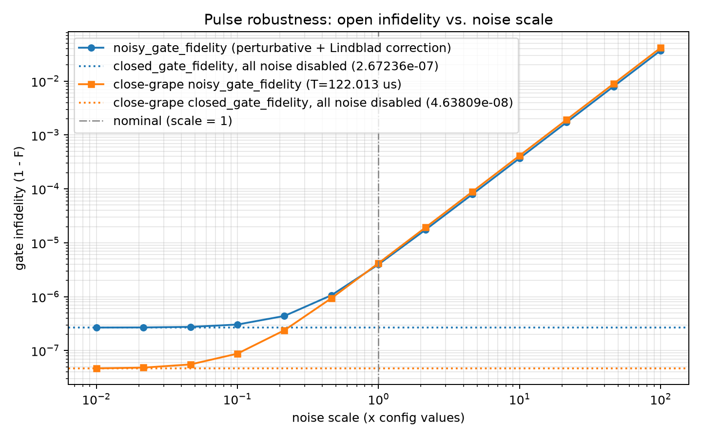

# Robustness Evaluation: Open Fidelity vs. Noise Scale

Generated at: 2026-08-12T13:54:38

All fluctuation sigmas and decoherence rates from the config are multiplied by each scale factor (noise types disabled in the config stay disabled); the pulse is then evaluated with `noisy_gate_fidelity`. `closed_gate_fidelity` (all noise disabled) is the scale -> 0 reference. The perturbative expansion is second-order in the noise strength, so values at large scales are qualitative at best.

## Run Summary

| Parameter | Value |
| --- | --- |
| config | experiments/spin_boson/robustness_eval/flattop_122us/config.yaml |
| pulse_npz | experiments/spin_boson/robustness_eval/flattop_122us/final_pulse_s400_T122.npz |
| close_grape_pulse_npz | experiments/spin_boson/robustness_eval/flattop_122us/outputs/close-122us_20260812_133847/pulse/final_pulse_s400.npz |
| system_type | spin_boson |
| n_steps | 400 |
| total_time_us | 122.01330779422334 |
| close_grape_total_time_us | 122.013 |
| n_fluctuation_terms (scale=1) | 4 |
| n_decoherence_channels (scale=1) | 0 |
| scales | 0.01, 0.0215443, 0.0464159, 0.1, 0.215443, 0.464159, 1, 2.15443, 4.64159, 10, 21.5443, 46.4159, 100 |
| faithful | False |
| hermite_points | NA |
| y_scale | infidelity |
| workers | 10 |
| closed_gate_fidelity | 0.999999732764 |
| close_grape_closed_gate_fidelity | 0.999999953619 |
| wall_s | 17.6 |

## Fidelity vs. Noise Scale

| scale | noisy_gate_fidelity | faithful_gate_fidelity | close_grape_noisy_gate_fidelity | close_grape_faithful_gate_fidelity |
| --- | --- | --- | --- | --- |
| 0.01 | 0.999999732394 | not computed | 0.999999953205 | not computed |
| 0.0215443 | 0.999999731046 | not computed | 0.999999951699 | not computed |
| 0.0464159 | 0.999999724788 | not computed | 0.999999944704 | not computed |
| 0.1 | 0.999999695744 | not computed | 0.999999912241 | not computed |
| 0.215443 | 0.999999560931 | not computed | 0.999999761558 | not computed |
| 0.464159 | 0.999998935185 | not computed | 0.99999906215 | not computed |
| 1 | 0.999996030731 | not computed | 0.999995815787 | not computed |
| 2.15443 | 0.999982549447 | not computed | 0.999980747505 | not computed |
| 4.64159 | 0.999919974873 | not computed | 0.999910806734 | not computed |
| 10 | 0.999629529427 | not computed | 0.999586170431 | not computed |
| 21.5443 | 0.998281401089 | not computed | 0.998079342196 | not computed |
| 46.4159 | 0.992023943651 | not computed | 0.991085265083 | not computed |
| 100 | 0.96297939908 | not computed | 0.958621634854 | not computed |

## Figure

